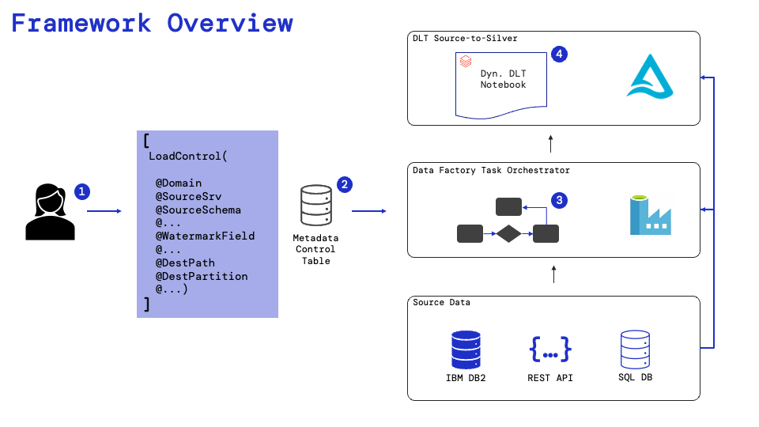
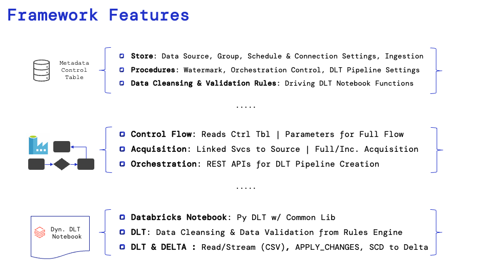

# Blueprint Metadata Driven Framework

## Abstract

The Blueprint Metadata Driven Framework is an accelerator that simplifies the data ingestion, cleansing, and validation process using Databricks and Azure Data Factory. The framework utilizes a control table to read, validate, and write data to a Delta Lake table. It includes features for data cleansing, logging, error control, and data source grouping for various source types, including SQL, Rest/API, Oracle, and DB2.

The Blueprint Metadata Driven Framework is a key accelerator in our [Databricks Center of Excellence](https://bpcs.com/databricks) solutions.

## Overview

## Features

